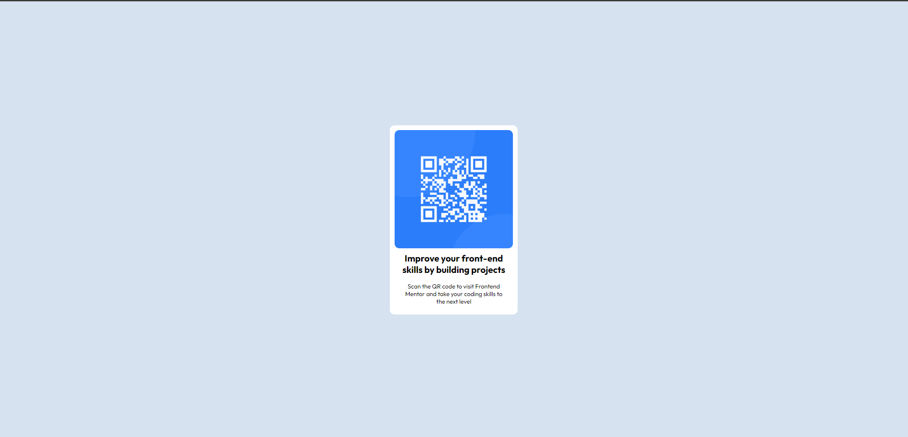
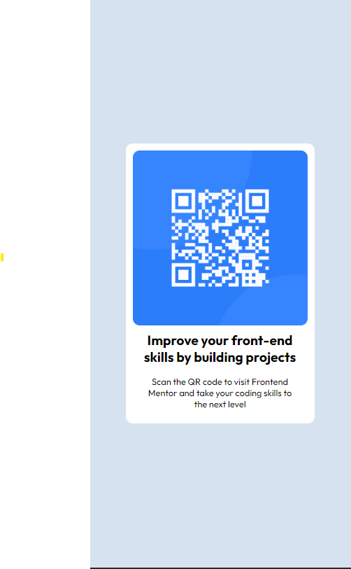

# Frontend Mentor - QR code component solution

This is a solution to the [QR code component challenge on Frontend Mentor](https://www.frontendmentor.io/challenges/qr-code-component-iux_sIO_H). Frontend Mentor challenges help you improve your coding skills by building realistic projects.

## Table of contents

- [Screenshot](#screenshot)
- [Links](#links)
- [My process](#my-process)
  - [Built with](#built-with)
- [Author](#author)

### Screenshot

### Links

- Solution URL: [Add solution URL here](https://github.com/thelocalgodd/qr-code-component-main)
- Live Site URL: [Add live site URL here](https://qr-code-component-main-nine-mu.vercel.app/)

## My process

- Used a few divs (basic html) and basic css to build the site. it was a great first project

### Built with

- HTML5 markup
- CSS custom properties
- Flexbox
- Mobile-first workflow

## Author

- Website - [Vincent](https://thelocalgodd.github.io)
- Frontend Mentor - [@thelocalgodd](https://www.frontendmentor.io/profile/thelocalgodd)
- Twitter - [@0x5412](https://www.twitter.com/0x5412)
